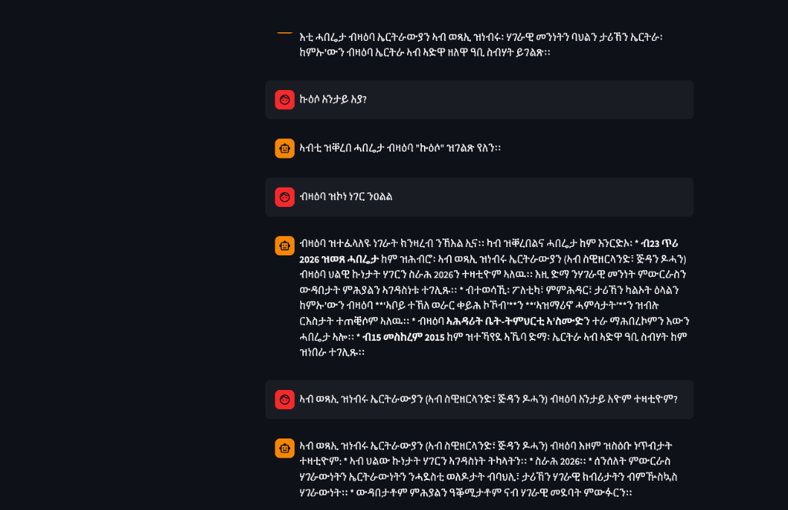

# Tigrinya Agent - Complete NLP Pipeline

A comprehensive tool for scraping, processing, and analyzing Haddas Ertra Tigrinya newspapers from shabait.com. Features a complete NLP pipeline from raw PDF extraction to advanced linguistic analysis.

## Features

### 🖥️ **Script Runner UI**
- **Single dashboard**: Run all pipeline scripts (Scraper, PDF Processor, Llama Ingest, Pipeline, Store Data, etc.) from one web interface
- **Live output**: Stream script output in real time
- **Configuration**: Central popup to set scraper limit, Qdrant host/port, collection names, batch sizes

### 📥 **Data Acquisition**
- 🕷️ **Automated Scraping**: Download a configurable number of Haddas Ertra newspaper PDFs (default 20)
- 📄 **Multi-page Navigation**: Handles pagination to access older articles
- 🔍 **Smart PDF Detection**: Locates download links using image-based navigation

### 🧹 **Text Processing**
- 📖 **PDF Extraction**: Advanced text extraction from newspaper PDFs
- 🌍 **Ge'ez Script Focus**: Preserves only Tigrinya characters, numbers, and punctuation
- 🧹 **Noise Removal**: Eliminates English words, navigation elements, and artifacts
- 📊 **Quality Validation**: Word count verification and content checks

### 🤖 **NLP Pipeline**
- 🏷️ **POS Tagging**: Advanced Part-of-Speech analysis with Gemini 2.5 Flash
- 🔍 **Grammatical Review**: Skeptical Tigrinya grammarian validation
- ⚖️ **Morphological Analysis**: Prefix detection and compound word handling
- 🌍 **Geopolitical Focus**: Special attention to Eritrean entities and proper nouns

## Installation

### Prerequisites

- Python 3.8+
- Git

### Step 1: Clone the Repository

```bash
git clone https://github.com/tsegaimerhawi/tigrinya-agent.git
cd tigrinya-agent
```

### Step 2: Create Virtual Environment

```bash
python -m venv .env
source .env/bin/activate  # On Windows: .env\Scripts\activate
```

### Step 3: Install Dependencies

```bash
pip install -r requirements.txt
```

### Step 4: Install Playwright Browsers

```bash
playwright install chromium
```

### Step 5: Set up Google Gemini API Key

The NLP pipeline requires a Google Gemini API key for POS tagging and topic summarization.

1. Visit [Google AI Studio](https://aistudio.google.com/)
2. Sign in with your Google account
3. Click on "Get API key" or go to API Keys section
4. Create a new API key for Gemini Flash 2.5
5. Copy the API key
6. Open the `.env_config` file and replace `YOUR_API_KEY_HERE` with your actual API key:

```bash
# In .env_config file:
GOOGLE_API_KEY=your_actual_api_key_here
```

### Step 6: Set up Qdrant Vector Database (Optional)

For vector storage and semantic search capabilities:

1. Install Qdrant:
   ```bash
   # Using Docker (recommended)
   docker run -p 6333:6333 qdrant/qdrant
   ```

2. Verify Qdrant is running:
   ```bash
   curl http://localhost:6333/collections
   ```

## Usage

### Script Runner UI (recommended)

Run all pipeline scripts from a single web interface with live output and central configuration:

```bash
python script_runner.py
```

Then open **http://localhost:8765** in your browser. You can:

- **Configuration** — Click **Configuration** to open a popup and set all variables (scraper limit, Qdrant host/port, collection names, batch sizes, etc.). Values are saved to `runner_config.json`.
- **Run scripts** — Use the buttons to run: Scraper, PDF Processor, Llama Ingest, Run Pipeline, Store Data, Store Sentences, Check Qdrant, Test RAG, Validate Results. Output streams in real time.

### Command-line usage

#### Step 1: Scrape and Download PDFs

```bash
python scraper.py
# Or limit the number of newspapers:
python scraper.py --limit 10
```

This will:
- Navigate to shabait.com Haddas Ertra section
- Collect article URLs across multiple pages
- Download PDFs using direct links
- Save metadata to `pdf_metadata.json`

#### Step 2: Process and Extract Text

```bash
python pdf_processor.py
```

This will:
- Extract text from all downloaded PDFs using pdfplumber
- Clean text to remove English words and navigation elements
- Keep only Ge'ez script characters (መበል, ዓመት, ኤርትራውያን, etc.)
- Save structured JSON to `raw_data.json`

#### Step 3: Validate Results

```bash
python validate_results.py
```

This shows:
- Total PDFs processed
- Word counts per article
- Confirmation of English word removal

## File Structure

```
tigrinya-agent/
├── script_runner.py       # Web UI to run scripts and configure (port 8765)
├── runner_config.json     # Central config (scraper limit, Qdrant, batch sizes, etc.)
├── scraper.py             # PDF downloader (--limit N)
├── pdf_processor.py       # Text extraction and cleaning
├── llama_ingest.py        # LlamaIndex ingestion into Qdrant
├── run_pipeline.py        # Full NLP pipeline (tagger → critic → refiner)
├── store_data.py          # Store refined articles in Qdrant
├── store_sentences.py     # Store sentences in Qdrant
├── agent_tagger.py        # POS tagging agent
├── agent_critic.py        # Grammar validation agent
├── agent_refiner.py       # Data structuring agent
├── retriever.py           # Qdrant semantic search
├── agent_rag.py           # RAG question-answering agent
├── app.py                 # Streamlit chat UI
├── validate_results.py    # Results validation script
├── check_qdrant.py        # Qdrant connection check
├── pdf_metadata.json      # Download tracking metadata
├── raw_data.json          # Processed text data
├── requirements.txt       # Python dependencies
├── pdfs/                  # Downloaded PDF files (gitignored)
└── README.md              # This file
```

## Output Format

### raw_data.json Structure

```json
[
  {
    "index": 1,
    "news_title": "Haddas Ertra 23 January 2026",
    "article_url": "https://shabait.com/2026/01/23/haddas-ertra-23-january-2026/",
    "publication_date": "On Jan 23, 2026",
    "pdf_filename": "On Jan 23, 2026_Haddas Ertra 23 January 2026.pdf",
    "pdf_url": "http://www.erinewspapers.com/hadas-eritrea/haddas_eritra_23012026.pdf",
    "extracted_text": "መበል ዓመት ቁ. ዓርቢ ጥሪ ገጻት ናቕፋ ገገጽጽ...",
    "word_count": 12732,
    "processing_status": "completed"
  }
]
```

## Configuration

When using the **Script Runner UI**, click **Configuration** to edit all settings in one place (saved to `runner_config.json`). Configurable values include:

- **Scraper:** number of newspapers to scrape
- **Paths:** PDF directory
- **Qdrant:** host, port
- **Collections:** LlamaIndex, corpus, and sentences collection names
- **Batch sizes:** Llama ingest batch size and delay; pipeline sentences per article; store-sentences batch size

When running scripts from the command line, you can still override scraper limit:

```bash
python scraper.py --limit 30
```

The scraper uses a 4-second delay between downloads (configurable in `scraper.py` if needed).

## Text Cleaning Features

The processor performs comprehensive cleaning:

1. **Noise Removal**: PAGE numbers, prices, URLs, copyright text
2. **English Word Removal**: All ASCII letter sequences
3. **Navigation Elements**: Bullets (•), special characters (), menu items
4. **Character Filtering**: Keeps only Ge'ez script (፡።፣፤፥፦፧፨) + numbers + punctuation
5. **Whitespace Cleanup**: Normalizes spacing and line breaks

## Troubleshooting

### Common Issues

**"No PDF link found"**
- Some articles may not have downloadable PDFs
- Check if the article page structure has changed

**"Download failed"**
- Network timeouts - the script retries automatically
- Server blocking - increase delays between requests

**"No Ge'ez text found"**
- PDF may be image-based rather than text-based
- OCR would be needed for image PDFs

### Manual Verification

Check downloaded PDFs:
```bash
ls -la pdfs/
```

Validate metadata:
```bash
python -c "import json; print(len(json.load(open('pdf_metadata.json'))))"
```

## 🏷️ **POS Tagging Pipeline**

The project now includes an advanced NLP pipeline with two specialized agents:

### **Agent 1: POS Tagger** (`agent_tagger.py`)
- **Role**: Linguistic Analysis Specialist
- **Technology**: LangGraph + Gemini 2.5 Flash LLM
- **Function**: Performs Part-of-Speech tagging on Tigrinya text
- **Tags**: Noun, Verb, Adjective, Particle (with geopolitical entity focus)
- **Validation**: Checks for Ge'ez script purity and LLM hallucination

### **Agent 2: Critic** (`agent_critic.py`)
- **Role**: Senior Tigrinya Grammarian (skeptical personality)
- **Function**: Validates POS tagging accuracy
- **Checks**:
  - Missing morphological prefixes (e.g., prepositions)
  - Proper noun tagging accuracy
  - Compound word analysis
  - Geopolitical entity recognition
- **Output**: `PASSED` or detailed `FEEDBACK` list

### **Agent 3: Refiner** (`agent_refiner.py`)
- **Role**: Data Engineer specializing in NLP
- **Function**: Structures and refines data for storage
- **Tasks**:
  - Convert Tigrinya dates to YYYY-MM-DD format
  - Generate 3-5 word topic summaries
  - Create structured dictionaries for database storage
- **Output**: Clean `RefinedArticle` objects with `article_id`, `tagged_tokens`, and `metadata`

### **Agent 4: Storage** (`store_data.py`)
- **Role**: Vector Database Manager
- **Function**: Stores processed articles in Qdrant vector database
- **Tasks**:
  - Initialize Qdrant collection 'tigrinya_corpus'
  - Generate embeddings for article text using Google Generative AI
  - Store full article data (POS tags, metadata) as payload
- **Requirements**: Qdrant running locally on port 6333

### **Main Pipeline** (`main.py`)
- **Function**: Orchestrates the complete workflow
- **Flow**: Text Loading → POS Tagging → Grammatical Review → Data Refinement → Storage
- **Output**: Comprehensive analysis with statistics and feedback

### 🧠 **RAG System (Retrieval-Augmented Generation)**

A fully functional RAG system allows you to chat with the ingested Tigrinya corpus.

#### **WEB INTERFACE** (New!)


Run the modern chat interface:
```bash
python -m streamlit run app.py
```

#### **1. Retriever** (`retriever.py`)
- **Engine**: Qdrant Vector Database
- **Model**: `models/gemini-embedding-001` (3072 dimensions)
- **Function**: Performs semantic search to find relevant articles

#### **2. RAG Agent** (`agent_rag.py`)
- **Model**: **Gemini 2.5 Flash** (Optimized for speed & quota)
- **Function**: Answers user questions using retrieved context
- **Language**: Supports questions in both Tigrinya and English

#### **3. Chat Interface** (`chat.py`)
- **Type**: CLI (Command Line Interface)
- **Features**: Interactive chat session with context-aware answers

### **Usage**
```bash
# Run complete 3-agent pipeline (recommended)
python main.py

# Store processed data in Qdrant (Required for RAG)
python store_data.py

# Start the Chat Interface
python chat.py
# Or ask a specific question
python chat.py "ኤርትራ እንታይ እያ?"

# Run individual agents
python agent_tagger.py    # POS tagging only
python agent_critic.py    # Validation only
python agent_refiner.py   # Data structuring only
```

### **Output Files**
- `complete_pipeline_results.json` - Full pipeline results
- `refined_articles.json` - Structured articles ready for storage
- `raw_data.json` - Original processed text data
- `pdf_metadata.json` - Download tracking and metadata

## Dependencies

- **playwright**: Web scraping and browser automation
- **pdfplumber**: PDF text extraction
- **requests**: HTTP downloads
- **fastapi**, **uvicorn**: Script Runner web UI
- **streamlit**: Chat interface (optional)
- **qdrant-client**, **llama-index**, **langchain-google-genai**: Vector store and RAG

## License

This project is for educational and research purposes. Please respect website terms of service and copyright laws when using the scraped content.

## Contributing

1. Fork the repository
2. Create a feature branch
3. Make your changes
4. Test thoroughly
5. Submit a pull request

## Author

Tsegai Merhawi - Tigrinya NLP and newspaper digitization project
